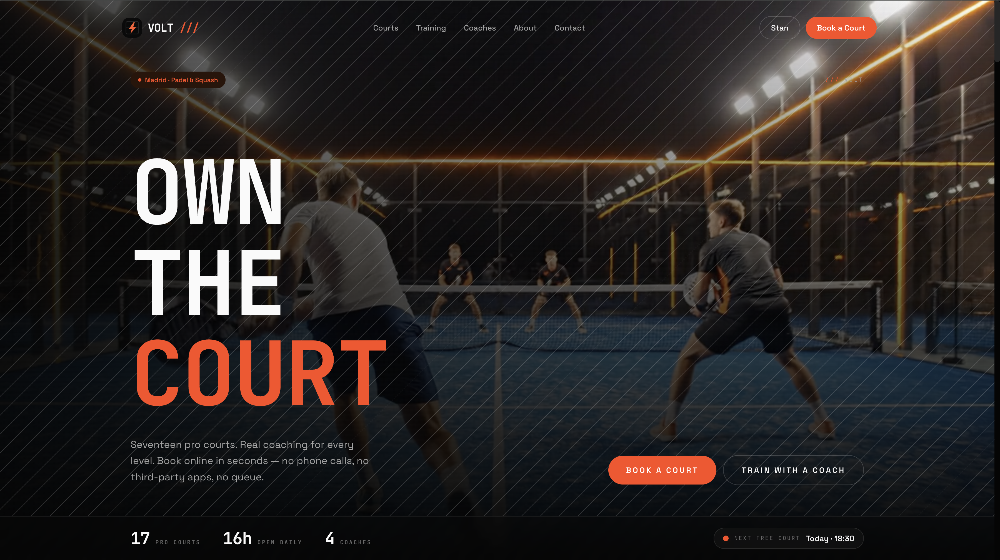
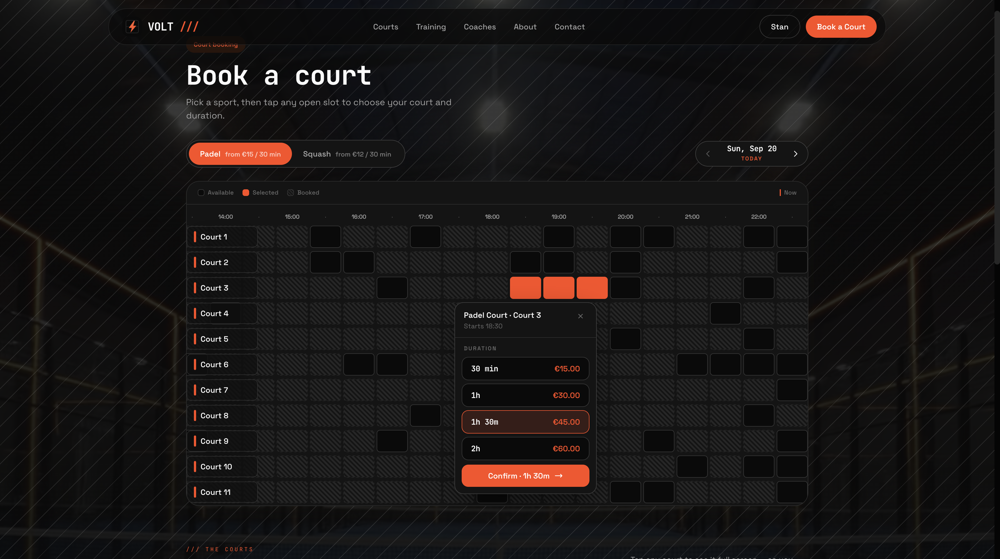
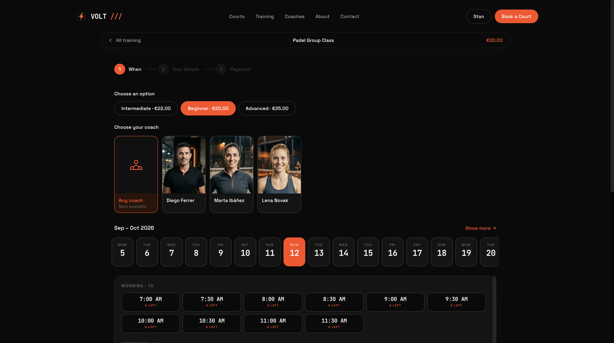

# VOLT — Next.js Padel & Squash Club Booking Template

A production-ready booking website for padel & squash clubs. Built with **Next.js 15**, **Tailwind CSS v4**, and the **Opencals Storefront SDK**.

**[View Live Demo →](https://template-volt.vercel.app)**


A dark, technical club aesthetic — near-black surfaces, electric-orange accent, and a monospace display face — with **two booking surfaces over one store**: a Playtomic-style in-page **court booking grid** for rentals, and a classic **coach-led training flow** for lessons and group classes. Full storefront included — courts, trainings, coaches, checkout, customer accounts — wired up out of the box. MIT licensed: clone it, rebrand it, ship it.

---

## Get Started in 3 Steps

### 1. Create an Opencals account

Sign up at **[app.opencals.com](https://app.opencals.com)** and create a **Dev Store**. When prompted for a dataset, choose the **VOLT Padel & Squash** preset — this seeds your store with the club's padel and squash courts, coaches, training classes, add-ons, and its venue so your template looks exactly like the demo.

### 2. Get your API key

Go to your **User Account Settings** in the Opencals dashboard and generate a **Storefront API key**. You'll need this to connect the template to your store.

### 3. Deploy to Vercel

[](https://vercel.com/new/clone?repository-url=https%3A%2F%2Fgithub.com%2Fletsopencals%2Ftemplate-volt&env=OPENCALS_API_KEY,AUTH_SECRET&envDescription=API%20key%20from%20your%20Opencals%20dashboard%20and%20a%20random%20secret%20for%20auth&project-name=volt&repository-name=template-volt)

During deployment, Vercel will ask you to set environment variables:

| Variable | Value |
|----------|-------|
| `OPENCALS_API_KEY` | Your Storefront API key (starts with `sfk_`) |
| `AUTH_SECRET` | Any random string — used for session encryption |
| `NEXT_PUBLIC_STRIPE_PUBLISHABLE_KEY` | *(optional)* Stripe publishable key for payments |

That's it. Once deployed, you'll have the same fully functional booking site as the [live demo](https://template-volt.vercel.app).

---

## The Storefront

A full-bleed, cinematic homepage — sport-first, with a live "next free court" chip, a two-mode intro (rent a court vs. train with a coach), a coaches teaser, and a facility gallery — all driven by your Opencals data.



<!-- Add more storefront screenshots here as you capture them, e.g.:


-->

---

## What's Included

### Court Booking Grid

The centerpiece. A single grid shows **every court and every open slot at once** — no more guessing what's free. Flip the **Padel / Squash** toggle to switch which courts fill the rows, step through days, and tap any open cell to pick a court and duration. Each court is its own resource, so booking one court leaves every other court free — booked exactly like a real club.

- **Custom durations.** Courts book in 30-minute steps up to two hours; the grid composes consecutive free slots into 30 / 60 / 90 / 120-minute options and prices each one live.
- **Hover-preview & confirm.** Hovering a duration highlights the spanned cells on the grid; a Confirm button commits — no accidental redirects.
- **Sport backdrop & court gallery.** The grid sits over an ambient, sport-aware backdrop, with a gallery of every court below so players know exactly where they'll play.



### Coach-Led Training

A separate, classic booking flow for lessons and classes. Browse the training catalog by sport, level (Starter → Advanced) and format (individual vs. group), pick a coach — or **"Any coach"** — choose a date and time, then check out. Group classes show **live "N left"** spots and fill up as they book.



### Two Resource Models, One Store

- **Courts** are staffless resources (the Opencals *Self* rule + `maxAttendees: 1`) — an independent, exclusively-booked unit each.
- **Trainings** are assigned to real **coaches** (the *Staff* rule) and can carry **group capacity** (`maxAttendees > 1`), which drives the "spots left" display.

Order and appointment detail reads naturally either way — "Padel Court 3 — 90 min" for a rental, "Intermediate Group — with Coach Marta" for a class.

### Checkout with Stripe

Multi-step checkout with add-ons (racket & ball rental, etc.), custom questions, customer info, and secure payment via Stripe Elements. Auto-login after checkout so the player lands in their account with the new booking.

### Customer Accounts

Passwordless sign-in by default: players enter their email and receive a 6-digit login code (password sign-in stays available as a fallback). Once signed in they can view bookings, browse order history, manage their profile, and reschedule or cancel.

One-time email links from Opencals (view/reschedule/cancel booking, leave feedback, verify email, reset password) all resolve through the `/link/[token]` route, which signs the customer in and redirects them to the right place.

> **Set your Storefront Base URL.** For emailed links to point back to this app, set **Storefront Base URL** in your Opencals dashboard (Settings → API) to your deployed URL (e.g. `https://your-domain.com`). Opencals builds every customer link as `{storefrontBaseUrl}/link/{token}`.

### Cinematic Hero, Video-Ready

The homepage hero is a full-bleed background that upgrades to a looping video automatically when `public/videos/hero.mp4` is present, and falls back to a still image otherwise — zero code changes either way.

### Mobile-First Design

Fully responsive. The court grid scrolls horizontally on phones with a sticky court-name column; the training flow is a card-stack that feels native on mobile and expands to two columns on desktop.

### SEO Ready

Per-page metadata, Open Graph cards, `SportsActivityLocation` structured data, robots.txt, and sitemap.xml — configured out of the box.

---

## Tech Stack

| Category | Technology |
|----------|-----------|
| Framework | Next.js 15 (App Router) |
| Styling | Tailwind CSS v4 |
| Animations | Framer Motion |
| Forms | react-hook-form + Zod |
| Payments | Stripe Elements |
| Auth | NextAuth.js v5 |
| Dates | moment-timezone |
| API | Opencals Storefront SDK (v0.3.14) |

---

## Local Development

```bash
git clone https://github.com/letsopencals/template-volt.git
cd template-volt
npm install
cp .env.example .env
```

Edit `.env` with your values:

```
OPENCALS_API_KEY=sfk_your_key_here
AUTH_SECRET=change_me_to_a_random_string
```

```bash
npm run dev
```

Open [http://localhost:3000](http://localhost:3000).

---

## Customization

### Branding & Content

All club-specific copy is centralized in **`lib/site-config.ts`**:

- Club name, tagline, logo wordmark
- The two sports (labels, court counts, price hints, collection slugs)
- Homepage hero, "two ways to play" modes, training levels, stats, process steps
- Coaches, gallery, testimonials, FAQs
- About page story, contact information (address, phone, email, hours)
- Footer links and social media

Edit this single file to rebrand the entire template. The bookable data (courts, trainings, coaches, prices, availability) comes from your Opencals store.

### Theme Colors

Design tokens live in **`app/globals.css`** as Tailwind v4 `@theme` properties. Token names are intentionally stable, so components keep working when you change the values:

```css
@theme {
  --color-bg: #0A0A0A;          /* near-black page background */
  --color-surface: #141414;     /* cards / panels */
  --color-ink: #FAFAFA;         /* primary text */
  --color-primary: #FF4A1C;     /* electric-orange accent */
  --font-display: 'JetBrains Mono', ui-monospace, monospace;
  --font-body: 'Space Grotesk', system-ui, sans-serif;
}
```

Tip: keep the accent aligned with your store's storefront primary color so the deployed site matches your Opencals settings.

### Imagery

Drop hero, sport, gallery, coach, and court images into `public/images/{hero,sports,gallery,coaches,courts}/` (and an optional `public/videos/hero.mp4`). See **`public/images/PLACEHOLDERS.md`** for filenames and recommended dimensions. Court, training and coach photos in the live booking flow come from your Opencals store, not this folder.

### Adding Pages

1. Create `app/your-page/page.tsx`
2. Add a `layout.tsx` with metadata
3. Add the link to `navLinks` in `components/layout/header.tsx`

---

## Project Structure

```
app/
  page.tsx                     # Homepage
  book/page.tsx                # Court booking grid (padel / squash toggle)
  training/page.tsx            # Training catalog (filter by sport / level / format)
  booking/[slug]/page.tsx      # Coach-led training booking flow
  thank-you/page.tsx           # Post-checkout confirmation
  coaches/                     # Meet the coaches
  about/                       # About page
  contact/                     # Contact form + info
  account/                     # Customer dashboard
  auth/                        # Sign in, sign up, password reset
  link/[token]/                # One-time email link resolver
  api/                         # API routes proxy SDK calls server-side

components/
  layout/{header,footer}.tsx   # Site chrome
  home/                        # Hero, modes, sports, training levels, coaches, gallery, ...
  booking/                     # Court grid, sport backdrop, court gallery, duration popover,
                               #   training flow (staff/time selectors), add-ons, checkout steps
  account/                     # Customer dashboard components
  ui/                          # Shared primitives (button, input, ...)

contexts/                      # cart, location, timezone, settings
hooks/                         # use-court-grid, use-court-booking, use-booking-flow, ...
lib/                           # site-config, opencals (SDK), auth (NextAuth), schemas, format, utils
```

## Environment Variables

| Variable | Required | Description |
|----------|----------|-------------|
| `OPENCALS_API_KEY` | Yes | Storefront API key from your Opencals dashboard |
| `AUTH_SECRET` | Yes | Random string for NextAuth session encryption |
| `NEXT_PUBLIC_STRIPE_PUBLISHABLE_KEY` | No | Stripe publishable key for payment processing |
| `OPENCALS_API_URL` | No | Override API base URL (defaults to production) |
| `NEXT_PUBLIC_BASE_URL` | No | Public site URL (for sitemap) |

---

## Other Templates

VOLT is one of the open-source booking templates built on the Opencals Storefront SDK. Same backend, different design and vertical:

- **[Clear Care](https://github.com/letsopencals/template-clarity)** — a medical clinic template with department-first booking. [Live demo](https://template-clarity.vercel.app)
- **[Frisor](https://github.com/letsopencals/template-frisor)** — a modern barbershop template with a dark editorial palette. [Live demo](https://template-frisor-sage.vercel.app)
- **[HAAR](https://github.com/letsopencals/template-haar)** — a hair-salon booking template with a light, warm palette. [Live demo](https://template-haar.vercel.app)

See all templates and the Storefront API at **[opencals.com/developers](https://opencals.com/developers)**.

## License

MIT
